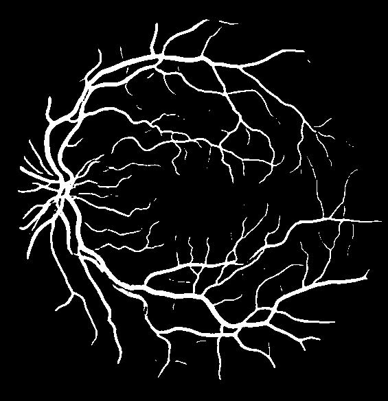
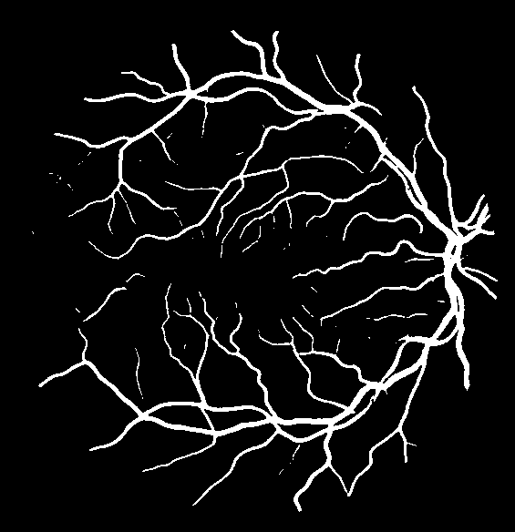
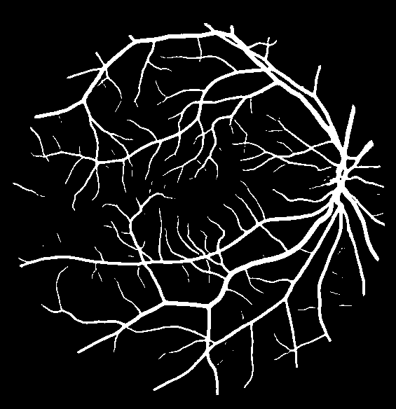
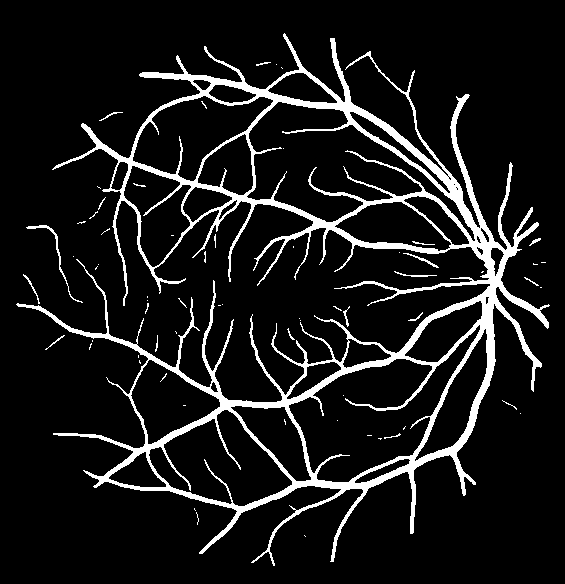

# Retinal Vessel Segmentation with U-Net

End-to-end retinal blood vessel segmentation on the DRIVE dataset, developed
with TensorFlow/Keras and evaluated through a controlled sequence of
cross-validation experiments.

**Authors:** Samuel Tamayo Balogh and Juan Prieto Fernández

The project began with an unstable full-image baseline and evolved into a
five-fold U-Net ensemble trained on balanced `128 x 128` patches. The final
system combines sliding-window inference, reversible test-time augmentation
(TTA), probability averaging and validation-selected thresholding. It achieved
a mean test DICE of **0.832967677712** against the two manual annotations
available in DRIVE.

## Final predictions

The repository contains all 20 binary masks produced by the final ensemble.
White pixels represent retinal vessels and black pixels represent background.

| Test 03 | Test 08 | Test 16 | Test 19 |
| --- | --- | --- | --- |
|  |  |  |  |

## Implemented system

- Configurable U-Net training for full images and balanced patches.
- Five-fold cross-validation without image leakage between training and
  validation.
- Robust mask handling for both `0/1` and `0/255` encodings.
- Symmetric padding as an alternative to aspect-ratio-distorting resizing.
- Synchronized geometric augmentation and image-only photometric augmentation.
- Balanced patch sampling for vessel-rich, thin-vessel and background regions.
- Sliding-window reconstruction, probability ensembling and reversible TTA.
- Validation-only threshold and postprocessing selection.
- Per-experiment logs, per-image scores, fold metadata and final segmentation
  outputs.

## Table of contents

1. [Project objectives](#project-objectives)
2. [Problem and dataset](#problem-and-dataset)
3. [Evaluation protocol](#evaluation-protocol)
4. [Development process](#development-process)
5. [Parameter selection and decision rationale](#parameter-selection-and-decision-rationale)
6. [Final method](#final-method)
7. [Results](#results)
8. [Repository structure](#repository-structure)
9. [Installation](#installation)
10. [Reproducing the pipeline](#reproducing-the-pipeline)
11. [Stored evidence and model-weight policy](#stored-evidence-and-model-weight-policy)
12. [Limitations and future work](#limitations-and-future-work)
13. [References](#references)

## Project objectives

The initial specification defined an end-to-end medical image segmentation
problem rather than an isolated model-training exercise. Its technical
objectives were:

1. understand convolutional networks and the role of the encoder, decoder and
   skip connections in U-Net;
2. implement the system with TensorFlow and Keras 3;
3. apply image-processing techniques appropriate for a small medical dataset,
   including augmentation, padding and patching;
4. implement and use DICE correctly instead of relying on background-dominated
   pixel accuracy;
5. train a five-fold U-Net system on DRIVE and exceed a mean DICE target of
   `0.75`, averaging the scores against both test experts;
6. return binary PNG segmentations with the same spatial dimensions as the
   original images;
7. preserve enough metadata for every fold to explain and reproduce each
   programming and experimental decision;
8. ensure that saved models are compatible with Keras 3 `load_model`.

The final ensemble reached **0.832967677712** mean test DICE, exceeding the
`0.75` target by **0.082967677712**. It produced the 20 required full-resolution
PNG masks and was evaluated independently against both manual test
segmentations.

## Problem and dataset

The task is binary semantic segmentation:

```text
retinal RGB image -> vessel probability map -> binary vessel mask
```

The project uses DRIVE: Digital Retinal Images for Vessel Extraction, a
benchmark created for comparative studies of retinal vessel segmentation. It
contains 40 fundus photographs divided into 20 training and 20 test images.

The training split provides:

- retinal images;
- one manual vessel annotation per image;
- one field-of-view (FOV) mask per image.

The test split also provides a second manual vessel annotation. Final test DICE
is therefore calculated against both experts and then averaged.

### Dataset access and repository policy

The DRIVE files are **not distributed in this repository**. The project links
to the [official DRIVE website](https://drive.grand-challenge.org/) so that
users obtain the data from its original source and review the applicable access
conditions themselves.

After downloading DRIVE, place it locally at:

```text
data/raw/DRIVE/
├── training/
│   ├── images/
│   ├── 1st_manual/
│   └── mask/
└── test/
    ├── images/
    ├── 1st_manual/
    ├── 2nd_manual/
    └── mask/
```

An important distinction discovered during the initial data audit is that
`1st_manual/` and `2nd_manual/` contain vessel annotations, while `mask/`
contains the retinal field of view. Treating the FOV as vessel ground truth
would invalidate the experiment.

## Evaluation protocol

### Primary metric

The primary metric is the Sørensen-Dice coefficient:

```text
DICE(P, G) = 2 * |P intersection G| / (|P| + |G|)
```

DICE is more informative than raw pixel accuracy for this task because vessel
pixels occupy a small fraction of a retinal image. A background-heavy
prediction can have deceptively high accuracy while failing to recover the
vascular tree.

The implementation was checked on artificial masks before any model result was
accepted:

```bash
python src/check_metrics.py
```

Expected output:

```text
same: 1.000000
different: 0.000000
partial: 0.500000
empty_vs_empty: 1.000000
```

### Cross-validation and test isolation

The 20 official training images are divided into five folds using a fixed seed
of `42`. Each fold trains on 16 images and validates on 4. When patch training
is used, the image-level split is completed before patch extraction, so patches
from one retina can never appear in both training and validation.

Thresholds are selected from out-of-fold validation predictions. The official
test split is evaluated only after the model configuration and threshold have
been chosen. This prevents test-set threshold tuning and preserves a clean
final comparison.

During test evaluation the prediction is compared independently with:

1. `1st_manual`;
2. `2nd_manual`;
3. the mean of both DICE values.

The FOV mask is applied before metric calculation so pixels outside the valid
retinal area do not affect the score.

## Development process

The final result was not produced by a single training run. It emerged from a
sequence of controlled experiments in which one limitation was addressed at a
time.

### 1. Data inspection and pipeline validation

The first stage checked file pairing, image dimensions, mask semantics and
binary mask conversion. `src/explore_drive.py` was created to print paired
samples and generate visual checks. The DICE implementation was validated
separately, and dry-run modes were added to verify loading, preprocessing,
model construction and callbacks without starting a full training run.

Images are converted to `float32` and normalized to `[0, 1]`. Mask
binarization first checks the stored range: values already encoded as `0/1`
are preserved, while `0/255` masks are thresholded safely. This avoided an
early failure mode in which applying a threshold of 127 to an already binary
mask would erase every vessel. Masks are transformed with nearest-neighbour
interpolation and re-binarized after geometric operations.

### 2. Initial full-image baseline

The first model used:

- a compact U-Net;
- `512 x 512` resized inputs;
- binary cross-entropy;
- five-fold cross-validation;
- flip augmentation;
- FOV masking during evaluation.

The baseline was unstable and tended toward nearly empty predictions. Lowering
the threshold to `0.20` did not solve the underlying learning problem: mean
test DICE remained **0.145489**.

This ruled out threshold adjustment as a sufficient fix and motivated a change
to the training objective and callback strategy.

### 3. BCE + Dice and stable validation monitoring

Binary cross-entropy was replaced with a combined BCE + Dice loss. The
checkpoint and early-stopping callbacks monitored `val_loss`, and a batch size
of one was used for stable full-resolution GPU memory consumption.

Adding synchronized flips and using the improved training configuration raised
the test DICE of the fold models to **0.758784**. Averaging probabilities from
the five folds before thresholding raised the result further to **0.780076**.

This was the first configuration that produced meaningful vessel masks and
confirmed that the architecture was capable of learning the task.

### 4. Preserving retinal geometry with padding

DRIVE images are not square. Resizing them to `512 x 512` changes their aspect
ratio and deforms vascular geometry. The pipeline was therefore extended with
symmetric padding to `592 x 576`, followed by cropping back to the original
size before evaluation.

The padded ensemble reached **0.794800** after 80 epochs. Extending training to
120 epochs with patience 16 reached **0.797511**. The consistent improvement
supported the hypothesis that anatomical geometry should be preserved.

### 5. Rich data augmentation

Augmentation was expanded beyond flips:

- rotations sampled from `[-12 degrees, +12 degrees]`;
- horizontal and vertical translations sampled from `[-16, +16]` pixels;
- brightness, contrast and gamma factors sampled from `[0.85, 1.15]`;
- Gaussian noise with standard deviation sampled from `[0, 0.01]`.

These deliberately moderate ranges add acquisition and positioning variability
without creating implausible retinal anatomy. Geometric transforms are
synchronized between image and mask. Photometric transforms affect only the
image, and the black exterior is kept black. Masks use nearest-neighbour
interpolation and are re-binarized after transformation.

The padded full-image ensemble with rich augmentation reached **0.812689**.
Reversible TTA increased it to **0.813414**.

### 6. Error analysis and the move to balanced patches

Visual inspection showed that the remaining errors were concentrated in thin,
low-contrast and discontinuous vessels. Full-image training still exposed the
network to far more background than vessel pixels.

The highest-impact change was therefore balanced patch training. Candidate
`128 x 128` patches are sampled from each training image and categorized as:

| Patch category | Sampling fraction |
| --- | ---: |
| Vessel-positive | 60% |
| Thin-vessel proxy | 20% |
| Low-vessel/background | 20% |

The final training configuration used:

| Parameter | Value |
| --- | ---: |
| Cross-validation folds | 5 |
| Training images per fold | 16 |
| Validation images per fold | 4 |
| Patch size | `128 x 128` |
| Candidate stride | 16 |
| Training patches per image | 512 |
| Validation patches per image | 256 |
| Batch size | 8 |
| Maximum epochs | 120 |
| Learning rate | `1e-4` |
| Early-stopping patience | 16 |
| Base filters | 16 |
| U-Net depth | 4 |
| Loss | BCE + Dice |
| Random seed | 42 |

Patch sampling increased the effective presence of vessels during training
without breaking image-level validation isolation.

### 7. Sliding-window inference, ensembling and TTA

Patch-trained models cannot directly process an entire retina. Full-size
probability maps are reconstructed by:

1. padding the image where required;
2. extracting overlapping `128 x 128` windows;
3. predicting each patch;
4. averaging probabilities in overlapping regions;
5. averaging the five fold probability maps;
6. applying the validation-selected threshold;
7. applying the FOV mask.

With stride 64, the patch ensemble reached **0.831036**. Reversible TTA raised
it to **0.832503**. Reducing the stride to 32 increased overlap and reached the
final **0.832968**, at the cost of slower inference.

TTA predicts the original image, horizontal flip, vertical flip and combined
horizontal/vertical flip. Each prediction is transformed back to its original
orientation before averaging.

### 8. Postprocessing and alternative losses

Several plausible improvements were evaluated and rejected:

| Method | Parameters | Hypothesis |
| --- | --- | --- |
| Connected-component filtering | 8-neighbour connectivity; minimum sizes `0, 2, 4, 8, 16` | Remove isolated false positives without changing the network |
| Weighted BCE + Dice | positive BCE weight `4.0` | Make missed vessel pixels four times more expensive than background errors |
| Focal Tversky | FP weight `alpha=0.3`; FN weight `beta=0.7`; exponent `0.75` | Bias the objective toward recall and difficult vessel pixels |
| Thin-weighted Dice | local `3 x 3` density proxy; weight factor `2.0` | Increase the contribution of sparse, likely thin-vessel pixels |

Connected-component filtering produced a marginal validation gain of
`+0.000103`, but reduced test DICE from `0.832968` to `0.832023`. It was not
adopted.

The alternative losses also underperformed BCE + Dice under the same patch,
stride and TTA protocol. Balanced patch sampling had already reduced much of
the foreground imbalance; additional positive weighting did not improve
generalization and sometimes increased false positives.

## Parameter selection and decision rationale

The parameters were not all selected in the same way. Keeping their provenance
separate is important:

| Selection mechanism | Parameters |
| --- | --- |
| Fixed by the evaluation protocol | DRIVE split, both test experts, DICE, five folds, original-size PNG output |
| Selected on cross-validation | probability threshold and candidate postprocessing size |
| Compared through controlled experiments | resize vs. padding, full image vs. patches, stride 64 vs. 32, TTA, ensemble, loss family |
| Literature-guided hypothesis | Focal Tversky asymmetry and focal exponent |
| Conservative engineering choice | U-Net capacity, augmentation ranges, patch sampling thresholds and training schedule |

The fixed engineering values were held constant when testing a new hypothesis.
This made comparisons interpretable: a loss experiment, for example, changed
the loss rather than silently changing architecture, augmentation and
inference at the same time.

### Data representation

| Decision | Value | Reason |
| --- | --- | --- |
| Image dtype and range | `float32`, `[0, 1]` | Stable neural-network input scale and consistent photometric augmentation |
| Vessel target | `1st_manual` during training | It is the vessel annotation available for every training image |
| Test references | `1st_manual` and `2nd_manual` | The required score must reflect agreement with both experts |
| FOV use | Mask probabilities outside the retina | Prevent the large invalid black exterior from generating false positives |
| Mask interpolation | Nearest neighbour | Preserve discrete `0/1` labels during geometric transforms |
| Output encoding | PNG with values `0` and `255` | Lossless binary masks in the required image format and original dimensions |

### U-Net capacity

The final network uses `base_filters=16`, `depth=4` and `dropout=0.0`.

- Four downsampling levels provide both local detail and enough receptive-field
  context for vessel continuity. With a `128 x 128` input, the bottleneck
  resolution is `8 x 8`, because `128 / 2^4 = 8`.
- The channel sequence `16 -> 32 -> 64 -> 128 -> 256` is deliberately compact.
  DRIVE has only 20 training images, so increasing capacity aggressively would
  raise memory cost and overfitting risk without addressing the dominant class
  imbalance.
- `128` is divisible by `2^4=16`, which guarantees that decoder feature maps
  align with the encoder skip connections.
- Dropout was left at zero to keep architecture constant while regularization
  was supplied by dynamic patch sampling, five-fold training, augmentation,
  early stopping and checkpoint restoration. No experiment demonstrated that
  extra dropout was needed.
- Two `3 x 3` ReLU convolutions per block capture local vessel edges and
  junctions; skip connections restore high-resolution details after pooling.
  A one-channel sigmoid is sufficient because the task is binary.

### Cross-validation and training schedule

| Parameter | Value | Reason |
| --- | ---: | --- |
| Folds | 5 | With 20 training images, every fold can train on 16 and validate on 4; every image becomes validation data exactly once |
| Seed | 42 | Reproducible folds, initialization, patch sampling and augmentation |
| Optimizer | Adam | Adaptive first- and second-moment estimates for stable optimization with heterogeneous segmentation gradients |
| Initial learning rate | `1e-4` | Conservative step size for small batches and a small medical dataset |
| Learning-rate reduction | factor `0.5`, patience `4`, minimum `1e-6` | Refine the solution when validation loss stops improving |
| Batch size | 8 patches | Large enough to mix patch categories while fitting the available 4 GB GPU memory |
| Maximum epochs | 120 | Allows convergence beyond the earlier 20/60/80-epoch experiments |
| Early-stopping patience | 16 | Gives `val_loss` time to recover after plateaus without running all 120 epochs unnecessarily |
| Checkpoint monitor | `val_loss`, minimize | Save the fold state that best generalizes rather than the final epoch |
| Validation patches | Fixed per fold | Prevent random validation resampling from adding noise to model selection |
| Training patches | Resampled each epoch | Increase effective diversity without materializing a much larger dataset |

#### Why Adam was used

Adam was chosen because it combines momentum-like first-moment tracking with a
second-moment estimate of gradient magnitude. This gives each parameter an
adaptive effective step size. That is useful in vessel segmentation because
gradients from the dominant background, thick vessels and sparse thin-vessel
pixels can have very different scales.

The implementation creates:

```python
keras.optimizers.Adam(learning_rate=1e-4)
```

Only the learning rate is overridden; the remaining Adam parameters use the
defaults from the pinned Keras version. The selected `1e-4` rate is ten times
smaller than Adam's usual `1e-3` default, reducing the risk of unstable updates
with batches of eight and a hybrid BCE + Dice objective. If `val_loss` plateaus,
`ReduceLROnPlateau` halves the rate after four epochs, down to `1e-6`. Adam was
therefore used for fast, adaptive early optimization, while the scheduler
provides smaller late-stage steps for refinement.

#### Reproducible random augmentation

The global seed is `42`. At the start of training,
`keras.utils.set_random_seed(42)` initializes the Python, NumPy and Keras
backend random streams before model construction, making weight initialization
and framework-level random operations repeatable. The same base seed is used
as `random_state` when shuffling the five K-fold splits.

Patch training then derives a deterministic seed for each fold:

```text
fold_seed = 42 + sum(character codes in the fold name)
```

This keeps folds reproducible without forcing every fold to receive the same
random sequence. The validation patch set uses `fold_seed + 100000` and is
sampled once, so validation remains fixed throughout training. A training batch
uses:

```text
batch_seed = fold_seed + epoch * steps_per_epoch + batch_index
```

Consequently, rerunning the same configuration recreates the same patches,
flips, rotations, translations, brightness, contrast, gamma and noise for each
batch. At the same time, the epoch term deliberately changes the sequence
between epochs, preserving the diversity expected from online augmentation.
The same NumPy `Generator` is passed to patch selection and transformation
sampling, and the base seed is stored in every fold metadata file.

The seed controls the complete software randomization path. Exact bit-for-bit
identity can still depend on TensorFlow, CUDA and hardware-level deterministic
kernel support, but the dataset split and all explicitly sampled augmentation
parameters are reproducible.

Training was carried out under WSL2 on an NVIDIA GeForce RTX 3050 Laptop GPU
with 4 GB of dedicated VRAM. The implementation also supports CPU execution;
the GPU changed experiment duration, not the method.

### Model serialization and reproducibility

Custom metrics and losses are registered with
`keras.saving.register_keras_serializable(package="DriveUNet")`. This allows
Keras 3 to resolve project functions when a compiled model is loaded.
Inference scripts use `compile=False` because the optimizer and training losses
are unnecessary for prediction, while `src/check_model_load.py` explicitly
tests every fold before evaluation. Each model is accompanied by JSON metadata
containing its image-level split, seed, patch configuration, augmentation
ranges and training parameters. This is why threshold tuning can reconstruct
each fold's validation set without guessing or using test data.

### Balanced patch sampler

`128 x 128` was chosen as a compromise: it is large enough to contain vessel
context and bifurcations, small enough to make thin vessels occupy a meaningful
fraction of a sample, compatible with four U-Net pooling levels and efficient
enough for batches of eight.

| Parameter | Value | Reason |
| --- | ---: | --- |
| Candidate stride | 16 | Build a dense and diverse candidate pool; this is a sampling stride, not the final inference stride |
| Minimum FOV ratio | 0.50 | Reject mostly invalid exterior patches while retaining useful patches near the retinal boundary |
| Positive vessel ratio | `>= 0.01` | Ensure positive candidates contain a non-trivial amount of vasculature |
| Background vessel ratio | `<= 0.002` | Keep genuinely low-vessel examples for specificity and false-positive control |
| Thin-vessel ratio | `>= 0.001` | Admit patches containing only a small amount of difficult fine structure |
| Thin-neighbour threshold | `<= 4` pixels in a `3 x 3` neighbourhood | Use low local vessel density as an inexpensive proxy for thin branches |
| Batch fractions | `0.60 / 0.20 / 0.20` | Emphasize vessels and hard thin regions without removing background supervision |
| Training patches per image | 512 per epoch | Provide broad spatial coverage and changing samples across epochs |
| Validation patches per image | 256 fixed | Obtain a stable but computationally manageable validation estimate |

Sampling only vessel patches would encourage over-segmentation. The 20%
background allocation is therefore intentional, while the 60% positive and
20% thin/difficult allocation counter the dominance of background in a full
retinal image.

### Loss functions

The adopted loss is:

```text
L = binary_crossentropy + (1 - soft_DICE)
```

BCE supplies local pixel-level probability supervision. Dice loss optimizes
global overlap and is much less vulnerable to the background majority. Their
unweighted sum was the simplest objective that produced stable masks and
remained the best after the sampler already addressed class imbalance.

The alternatives were parameterized as controlled hypotheses:

- **Weighted BCE + Dice:** vessel pixels receive weight `4.0`, while background
  pixels retain weight `1.0`. Four was a deliberately moderate multiplier:
  large enough to test whether missed vessels were under-penalized, but not so
  large that a few positive pixels completely dominated each batch.
- **Focal Tversky:** the coefficient is
  `TP / (TP + 0.3*FP + 0.7*FN)`. Therefore false negatives have approximately
  `2.33` times the denominator weight of false positives. This directly tests
  the error-analysis finding that thin vessels were being missed. The code
  raises `1 - Tversky` to `0.75`, equivalent to the `1/gamma` exponent with
  `gamma=4/3` used in the original
  [Focal Tversky formulation](https://arxiv.org/abs/1810.07842); it was a
  literature-guided setting rather than an arbitrary decimal.
- **Thin-weighted Dice:** a `3 x 3` average-pooling density proxy assigns sparse
  vessel pixels a weight between `1` and `3`
  (`1 + 2*thin_proxy`). The factor `2.0` increases their contribution without
  removing the global Dice objective.

All three ideas were motivated by the same observed weakness, but none improved
cross-validation or test DICE. The likely explanation is that balanced patch
sampling had already corrected much of the imbalance; adding further
asymmetry shifted the precision-recall balance too far.

### Augmentation

Flips are exactly reversible and preserve retinal plausibility. The richer
augmentation ranges were kept modest because stronger rotations, translations
or intensity shifts could create anatomically implausible examples or move too
much useful retina outside a patch.

| Transform | Range | Application |
| --- | --- | --- |
| Horizontal/vertical flips | Random | Image and mask |
| Rotation | `[-12 degrees, +12 degrees]` | Image bilinear; mask nearest neighbour |
| X/Y translation | `[-16, +16]` pixels | Image and mask |
| Brightness | `[0.85, 1.15]` | Image only |
| Contrast | `[0.85, 1.15]` | Image only |
| Gamma | `[0.85, 1.15]` | Image only |
| Gaussian noise std. | `[0, 0.01]` | Image only |

The mask is re-binarized after every geometric transform. Photometric
augmentation never touches the label, and pixels outside the retina remain
black.

### Inference, threshold and postprocessing

- **Sliding-window stride:** stride 64 gives 50% overlap for `128 x 128`
  patches. Stride 32 gives 75% overlap, reduces patch-boundary sensitivity and
  improved test DICE by `+0.000465`, so it was selected for maximum quality.
- **Ensemble:** probabilities from all five folds are averaged before
  thresholding. This reduces fold-specific variance and preserves uncertainty;
  voting on already binary masks would discard that information.
- **TTA:** only original, horizontal flip, vertical flip and both flips are
  used. They are exactly invertible and require no interpolated probability
  map. TTA improved stride-64 DICE by `+0.001467`.
- **Threshold:** the search evaluated `0.20` through `0.70` in steps of `0.05`
  on each fold's own validation images using the same stride/TTA/FOV inference
  configuration. `0.45` was selected before test evaluation.
- **Postprocessing:** minimum connected-component sizes `0, 2, 4, 8, 16` were
  compared under cross-validation with 8-neighbour connectivity. Size `8`
  produced only `+0.000103` CV DICE and then reduced test DICE by `-0.000945`.
  It was rejected because a small component can be a real thin vessel, not
  merely noise.

## Final method

The adopted system consists of:


### U-Net architecture

The model is a compact encoder-decoder U-Net with:

- four resolution levels;
- 16 base filters;
- two `3 x 3` ReLU convolutions per block;
- max pooling in the encoder;
- transposed convolutions in the decoder;
- skip connections between matching encoder and decoder levels;
- one-channel sigmoid output.

The network is optimized with Adam at a learning rate of `1e-4`. The final
models use BCE + Dice loss and store the best validation-loss checkpoint for
each fold.

## Results

### Experiment progression

The complete machine-readable log is available at
[`results/final/experiments_log.csv`](results/final/experiments_log.csv).

| Experiment | Main change | CV DICE | Test DICE |
| --- | --- | ---: | ---: |
| Initial baseline | Resize + binary cross-entropy | 0.163610 | 0.145489 |
| Full-image fold models | BCE + Dice + flips | 0.748145 | 0.758784 |
| Full-image ensemble | Probability averaging | — | 0.780076 |
| Padded ensemble, 80 epochs | Preserve original geometry | — | 0.794800 |
| Padded ensemble, 120 epochs | Longer training | — | 0.797511 |
| Padded augmented ensemble | Rich augmentation | — | 0.812689 |
| Padded augmented ensemble + TTA | Reversible inference TTA | 0.789705 | 0.813414 |
| Balanced patches, stride 64 | Patch sampling and reconstruction | 0.806193 | 0.831036 |
| Balanced patches, stride 64 + TTA | Add TTA | 0.810472 | 0.832503 |
| **Balanced patches, stride 32 + TTA** | **More overlap** | **0.810839** | **0.832968** |

### Final test metrics

The full summary is stored at
[`results/final/patch_ensemble_test_t045_stride32_tta_summary.csv`](results/final/patch_ensemble_test_t045_stride32_tta_summary.csv).

| Metric | Value |
| --- | ---: |
| Test images | 20 |
| DICE vs. expert 1 | 0.822739547491 |
| DICE vs. expert 2 | 0.843195807934 |
| **Mean DICE** | **0.832967677712** |
| Standard deviation | 0.014554450491 |
| Minimum per-image DICE | 0.802765130997 |
| Maximum per-image DICE | 0.863536208868 |
| Mean predicted positive ratio | 0.087405291550 |

Per-image scores are available at
[`results/final/patch_ensemble_test_t045_stride32_tta.csv`](results/final/patch_ensemble_test_t045_stride32_tta.csv).

### Final loss comparison

| Loss | Validation threshold | CV DICE | Test DICE | Decision |
| --- | ---: | ---: | ---: | --- |
| **BCE + Dice** | 0.45 | **0.810838848352** | **0.832967677712** | Adopted |
| Weighted BCE + Dice | 0.70 | 0.808165812492 | 0.829797510803 | Rejected |
| Focal Tversky | 0.85 | 0.806377938390 | 0.827176424861 | Rejected |
| Thin-weighted Dice | 0.75 | 0.781183657050 | 0.809394013882 | Rejected |

The selected model outperformed all three alternative losses on validation and
test. None of the alternatives improved any of the 20 test images over the
final BCE + Dice ensemble.

### Interpretation

The largest improvement came from balanced patch training, not from a more
aggressive loss. Compared with the best full-image ensemble using padding,
augmentation and TTA, the final patch ensemble improved mean test DICE by
approximately `+0.019554`.

The remaining errors are primarily thin or low-contrast vessels. TTA and the
smaller inference stride provided genuine but modest improvements, so stride 64
remains a reasonable speed/quality trade-off when inference cost matters.

## Repository structure

```text
.
├── data/
│   ├── raw/                         # local DRIVE dataset; ignored by Git
│   └── processed/                   # local derived data; ignored by Git
├── outputs/
│   ├── figures/                     # generated diagnostics; ignored by Git
│   ├── models/                      # generated weights; ignored by Git
│   ├── results/                     # temporary experiment outputs
│   └── segmentations/               # temporary predictions
├── results/
│   └── final/
│       ├── experiments_log.csv
│       ├── patch_ensemble_test_t045_stride32_tta.csv
│       ├── patch_ensemble_test_t045_stride32_tta_summary.csv
│       ├── model_checksums.sha256
│       ├── model_metadata/
│       └── segmentations/
├── src/
│   ├── data.py                      # DRIVE loading and preprocessing
│   ├── explore_drive.py             # pairing and visual data checks
│   ├── metrics.py                   # DICE and segmentation losses
│   ├── check_metrics.py             # deterministic metric checks
│   ├── model.py                     # configurable U-Net
│   ├── augment.py                   # synchronized augmentation
│   ├── train.py                     # full-image training
│   ├── train_patches.py             # balanced patch training
│   ├── patches.py                   # patch extraction and sampling
│   ├── patch_inference.py           # sliding-window reconstruction
│   ├── ensemble.py                  # shared ensemble helpers
│   ├── tune_threshold_cv.py         # full-image CV threshold search
│   ├── tune_threshold_patch_cv.py   # patch CV threshold search
│   ├── evaluate.py                  # single-model evaluation
│   ├── evaluate_ensemble.py         # full-image ensemble evaluation
│   ├── evaluate_patch_ensemble.py   # patch ensemble evaluation
│   ├── predict*.py                  # PNG segmentation generation
│   ├── diagnose*.py                 # visual diagnostics
│   ├── analyze_errors.py            # per-image error analysis
│   └── postprocess.py               # connected-component filtering
├── requirements.txt
└── README.md
```

Empty local-only directories contain `.gitadd` placeholders so their intended
layout remains visible after cloning.

## Installation

Create a virtual environment from the project root:

```bash
python -m venv .venv
```

Activate it on Linux or macOS:

```bash
source .venv/bin/activate
```

Activate it in Windows PowerShell:

```powershell
.\.venv\Scripts\Activate.ps1
```

Install the pinned dependencies:

```bash
python -m pip install --upgrade pip
pip install -r requirements.txt
```

The main stack is TensorFlow/Keras, NumPy, scikit-learn, scikit-image, OpenCV,
Pillow, pandas and Matplotlib.

For long NVIDIA GPU training runs, WSL2 is recommended because current
TensorFlow releases do not provide native-Windows GPU support.

## Reproducing the pipeline

### 1. Validate the dataset

```bash
python src/explore_drive.py --data-dir data/raw/DRIVE --split training
python src/explore_drive.py --data-dir data/raw/DRIVE --split test
python src/check_metrics.py
```

### 2. Run a lightweight full-image dry run

```bash
python src/train.py --dry-run --max-samples 2 --folds 1 --image-height 128 --image-width 128 --base-filters 4 --depth 2
```

### 3. Run a lightweight patch dry run

```bash
python src/train_patches.py --dry-run --max-samples 2 --folds 1 --patch-size 64 --candidate-stride 32 --patches-per-image 8 --val-patches-per-image 4 --batch-size 2 --base-filters 4 --depth 2 --augment-flips --augment-rich --output-dir outputs/models/patch_dry_run
```

### 4. Train the final five-fold patch models

Linux/WSL2:

```bash
TF_GPU_ALLOCATOR=cuda_malloc_async TF_FORCE_GPU_ALLOW_GROWTH=true python src/train_patches.py --folds 5 --patch-size 128 --candidate-stride 16 --patches-per-image 512 --val-patches-per-image 256 --batch-size 8 --epochs 120 --augment-flips --augment-rich --loss bce_dice --checkpoint-monitor val_loss --checkpoint-mode min --early-stopping-monitor val_loss --early-stopping-mode min --patience 16 --output-dir outputs/models/cv_bce_dice_patch128_balanced
```

Windows PowerShell:

```powershell
$env:TF_GPU_ALLOCATOR = "cuda_malloc_async"
$env:TF_FORCE_GPU_ALLOW_GROWTH = "true"
python src/train_patches.py --folds 5 --patch-size 128 --candidate-stride 16 --patches-per-image 512 --val-patches-per-image 256 --batch-size 8 --epochs 120 --augment-flips --augment-rich --loss bce_dice --checkpoint-monitor val_loss --checkpoint-mode min --early-stopping-monitor val_loss --early-stopping-mode min --patience 16 --output-dir outputs/models/cv_bce_dice_patch128_balanced
```

### 5. Verify saved models

```bash
python src/check_model_load.py --models-dir outputs/models/cv_bce_dice_patch128_balanced
```

### 6. Select the threshold on validation folds

```bash
python src/tune_threshold_patch_cv.py --models-dir outputs/models/cv_bce_dice_patch128_balanced --output-dir outputs/results/cv_bce_dice_patch128_balanced_stride32_tta --apply-fov --tta --stride 32 --predict-batch-size 32
```

### 7. Evaluate the held-out test split

```bash
python src/evaluate_patch_ensemble.py --models-dir outputs/models/cv_bce_dice_patch128_balanced --split test --threshold 0.45 --output outputs/results/cv_bce_dice_patch128_balanced_stride32_tta/patch_ensemble_test_t045_stride32_tta.csv --ensemble-name cv_bce_dice_patch128_balanced_ensemble_stride32_tta --apply-fov --tta --stride 32 --predict-batch-size 32
```

### 8. Generate the final PNG masks

```bash
python src/predict_patch_ensemble.py --models-dir outputs/models/cv_bce_dice_patch128_balanced --split test --threshold 0.45 --output-dir outputs/segmentations/patch_ensemble_test_t045_stride32_tta --apply-fov --tta --stride 32 --predict-batch-size 32
```

Output masks use:

```text
0   -> background
255 -> vessel
```

## Stored evidence and model-weight policy

The final five `.keras` fold models were trained and used to produce the
published results, but the weight files are intentionally **not included and
not linked** from this repository.

Together they occupy approximately 117 MB, are generated training artifacts
and would unnecessarily increase every clone of the repository. The code,
configuration, hashes, evaluation outputs and fold metadata provide a compact
and auditable record without distributing large binary files.

The repository retains the evidence required to audit the completed training:

- [`experiments_log.csv`](results/final/experiments_log.csv) records the full
  experiment progression and decisions;
- [`model_metadata/`](results/final/model_metadata/) stores each fold's split,
  seed, hyperparameters, sampling configuration and augmentation settings;
- [`model_checksums.sha256`](results/final/model_checksums.sha256) records the
  SHA-256 identity of each original trained model without distributing it;
- the final summary and per-image CSVs preserve the evaluation outputs;
- all 20 predicted test masks are stored in
  [`segmentations/`](results/final/segmentations/).

No model download URL is provided. The weights can be regenerated from the
documented training command after obtaining DRIVE from its official source.

## Limitations and future work

- DRIVE is small, with only 20 official training images.
- The system has not been externally validated on STARE, CHASE_DB1 or another
  retinal dataset.
- Thin and low-contrast vessels remain the dominant source of false negatives.
- The best result requires five models, four TTA orientations and stride-32
  sliding inference, making it slower than a single full-image model.
- The rejected losses are not universally inferior; they only failed to
  improve BCE + Dice under this dataset and protocol.

Promising next steps include:

- retina-specific illumination normalization;
- attention or multi-scale architectures;
- topology- or skeleton-aware objectives;
- probability calibration;
- external dataset validation;
- ensemble distillation into a single deployable model;
- profiling and batching improvements for sliding-window inference.

## Acknowledgements

This project uses the DRIVE benchmark and the U-Net architecture introduced by
Ronneberger, Fischer and Brox. Dataset ownership and access conditions remain
with the original DRIVE providers.

## References

- [DRIVE: Digital Retinal Images for Vessel Extraction](https://drive.grand-challenge.org/)
- [U-Net: Convolutional Networks for Biomedical Image Segmentation](https://arxiv.org/abs/1505.04597)
- [Tversky loss function for image segmentation using 3D fully convolutional deep networks](https://arxiv.org/abs/1706.05721)
- [A Novel Focal Tversky Loss Function with Improved Attention U-Net for Lesion Segmentation](https://arxiv.org/abs/1810.07842)
